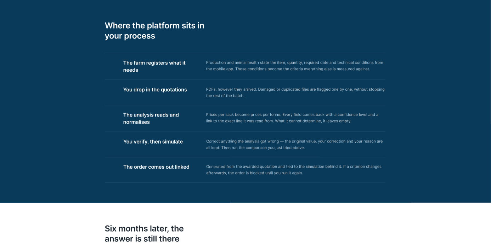
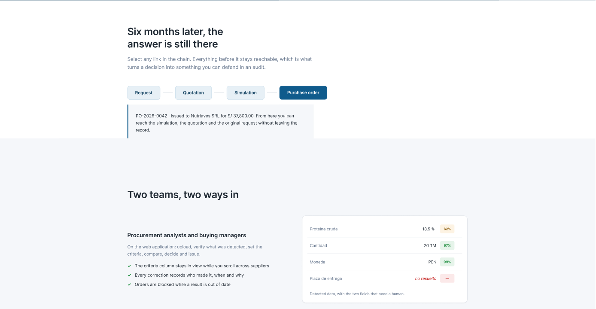
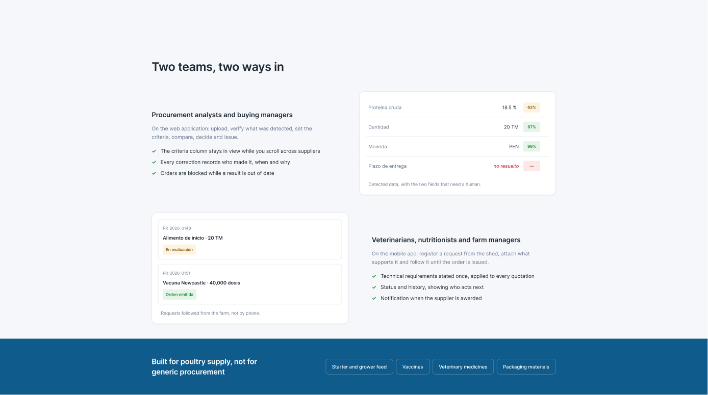
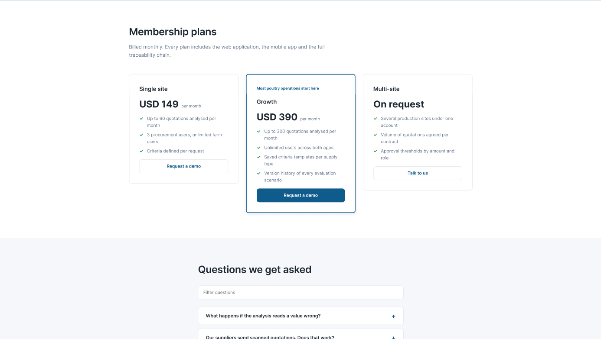
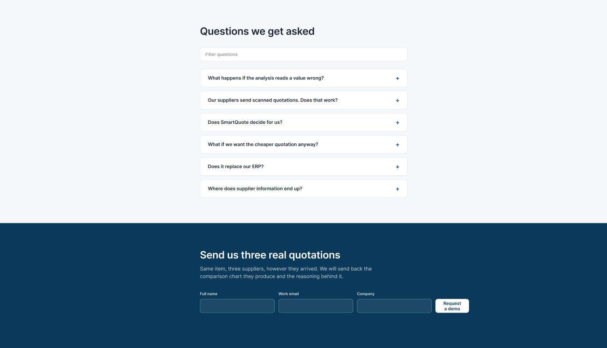

# SmartQuote Landing Page Solution

This is a solution for developing a landing page for SmartQuote, a SaaS platform designed for the comparative evaluation of supplier quotations in poultry production companies.

## Overview
The SmartQuote Project enables the digitalization of the procurement decision, replacing traditional methods such as retyping PDF quotations into spreadsheets with a centralised and traceable evaluation. Suppliers quote the same item in different structures, units and payment terms, and the platform normalises all of them before comparing.

### Visitors can explore:
- The same three supplier quotations shown as they actually arrive and after being normalised.

- An interactive simulator where weights and mandatory requirements change the winning quotation.

- A walkable traceability chain linking a purchase order back to its simulation, quotation and original request.

- Different benefits for procurement analysts on web and for production and animal health specialists on mobile.

- Membership plans ranging from a single production site to multi-site operations.

- Full content in English and Latin American Spanish through the i18n language switcher.

### Screenshots

### Links
- Solution URL : [https://upc-pre-202620-1asi0732-9108-smartquote.github.io/smartquote-landing-page/
](https://upc-pre-202620-1asi0732-9108-smartquote.github.io/smartquote-landing-page/)
### Build with
- Semantic HTML5 markup
- CSS Grid / Flexbox / Custom Properties
- Vanilla JavaScript (i18n, interactive simulator)

### Author
- SmartQuote
